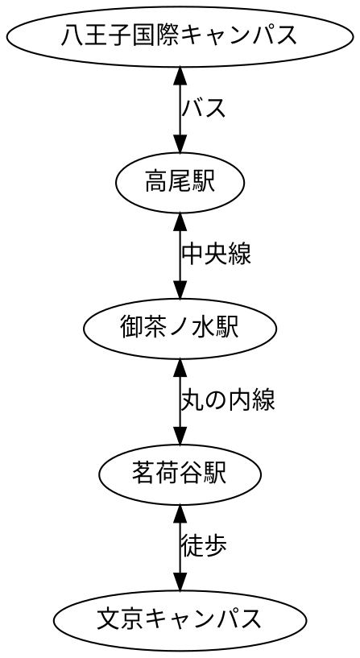

# 拓殖太郎の通学経路

[メンバー表に戻る](member.md#メンバー表)

```graphviz
digraph {
    edge [dir=both]

    // 例
    八王子国際キャンパス -> 高尾駅 [label=バス]
    高尾駅 -> 御茶ノ水駅 [label=中央線]
    御茶ノ水駅 -> 茗荷谷駅 [label=丸の内線]
    茗荷谷駅 -> 文京キャンパス [label=徒歩]
}
```
